<div align="center">

<picture>
  <source media="(prefers-color-scheme: light)" srcset="docs/assets/aura-hero-light.svg">
  
</picture>


# Aura

**Your music server, on your iPhone.** A native iPhone and Apple Watch player for Navidrome and Subsonic:
lossless streaming, lyrics that light up word by word, mixes built from your own listening, and your whole library offline.

<a href="https://github.com/adrbn/aura/releases/latest"></a>&nbsp;
<a href="#what-it-does"></a>&nbsp;
<a href="#two-builds">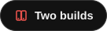</a>&nbsp;
<a href="#build-from-source">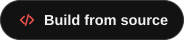</a>

<br>

[](#requirements)
[](#requirements)
[](#requirements)
[](#privacy)
[](https://github.com/adrbn/aura/releases/latest)
[](LICENSE)

<sub>App Store: coming soon, as <b>Aura: Self-Hosted Music</b> · Free and open source · Bring your own server</sub>

English · [Français](README.fr.md)

</div>

---

Aura plays the music on your own server. Point it at Navidrome, or any server that speaks the Subsonic API, and your
library is on your iPhone: streamed in its original quality, with lyrics in time, mixes built from what you actually
play, a Radar of new releases from your artists, and everything you download still there with no signal. The Apple
Watch app is a remote and a library on your wrist; in the car, CarPlay lays it all out again.

> **Aura is a client, not a music service.** Point it at a Navidrome or Subsonic-compatible server you own or have
> access to. It plays your library; it doesn't host, provide or find music for you.

## What it does

<table>
  <tr>
    <td align="center" valign="top" width="33%"><br><b>Lossless, with a real equalizer</b><br><sub>FLAC and ALAC stay lossless, or 128, 192 or 320 kbps on a slow line. Five bands from 60 Hz to 14 kHz, one curve you drag, 15 presets, ReplayGain.</sub></td>
    <td align="center" valign="top" width="33%">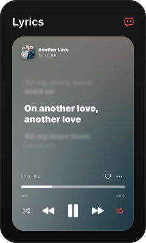<br><b>Lyrics in time</b><br><sub>Word by word when your server has per-word timing, line by line otherwise. From your server first, then <a href="https://lrclib.net">LRCLIB</a>. Tap a line to jump to it.</sub></td>
    <td align="center" valign="top" width="33%">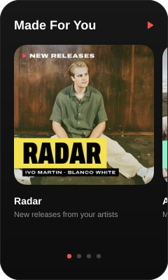<br><b>Made For You</b><br><sub>Mixes by time of day, mood and genre, each with its own cover. Instant Mix starts a radio from any song or artist. Year Wrapped counts your year on the iPhone.</sub></td>
  </tr>
  <tr>
    <td align="center" valign="top">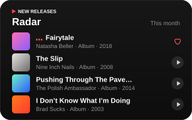<br><b>Radar</b><br><sub>This month's releases from the artists you play most. What your server has plays in full; the rest plays as 30-second previews.</sub></td>
    <td align="center" valign="top">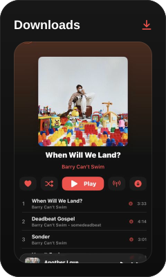<br><b>Offline, all of it</b><br><sub>Download a song, an album, a playlist or the whole library, each at its own quality. With no signal, the library, search and playback keep working.</sub></td>
    <td align="center" valign="top"><br><b>Apple Watch and CarPlay</b><br><sub>Now Playing, lyrics, Up Next and the library on your wrist, the Digital Crown on the volume. CarPlay in the App Store build.</sub></td>
  </tr>
</table>

**And also**

- **An editable queue.** Play next, add to the end, drag to reorder. When it runs out, autoplay carries on with similar songs.
- **Shuffle, repeat one or all, and a sleep timer** that stops after a set time or at the end of the song.
- **Scrobbling.** Plays go to your server, and are held on the iPhone while you're offline.
- **Lyrics you can fix.** Shift the timing if your Bluetooth headphones lag, or put a song's lyrics in time yourself: tap *Now* as each marked line starts. Your timing stays on the iPhone and wins over every other source. For a duet, a remix or another version, Aura checks that the lyrics match the version playing.
- **Lyrics translation**, optional, under each line, by Google's Gemini with a free API key of your own (Settings → Lyrics → Translation). A song is sent only when you tap translate, and only its lines, title and artist. Translations are kept for offline use.
- **Save a radio as a playlist** on your server, and its cover goes with it.
- **One search** across songs, albums, artists and playlists that forgives typos, with a Recently Searched list of what you played.
- **Playlists your way.** A grid or a list, filtered to pinned, radios, mixes, yours, shared or downloaded. Create them, reorder them and give them a cover from your photos; changes go to your server.
- **Pages in the colour of their artwork.** When your server has no cover for an album, Aura finds it in Deezer's catalogue.
- **A stream cache.** What you stream is kept as it plays, up to a size you set, and an offline mode you switch on stays on across launches.
- **Several servers**, switched from the Home title, and libraries split across music folders.
- **On the Lock Screen**, in Control Center and in the Dynamic Island, with AirPlay.
- **Siri and Shortcuts** in English and French: play, pause, skip, go back, shuffle, repeat, favourite a song, play a playlist or album by name, or play your favourites.
- **Share links.** Share a song as links that open it on other services.
- **Yours to arrange.** Light or dark, any accent colour, and tabs and Home sections in the order you choose.
- **A nightstand clock.** Switch it on, turn the phone sideways while music plays, and the artwork, the time or the lyrics fill the screen.

## Screenshots

<p align="center">
  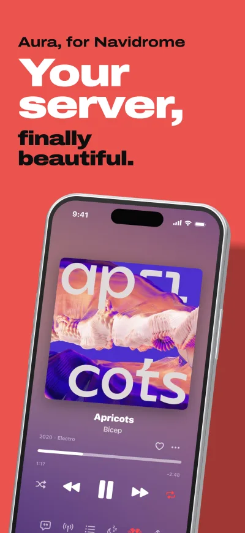
  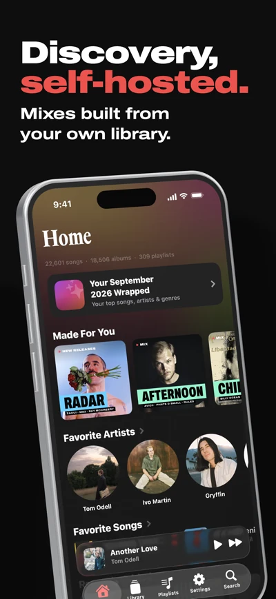
  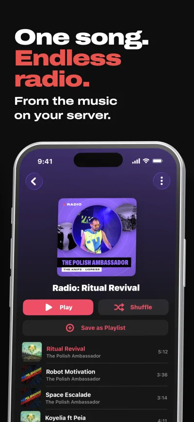
  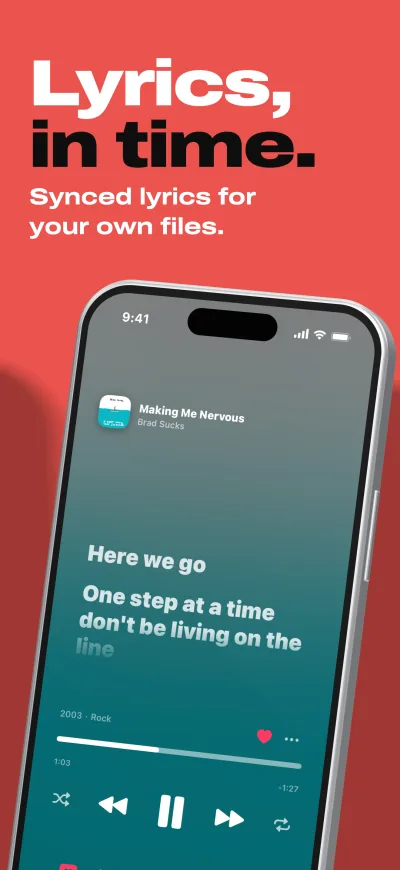
</p>
<p align="center">
  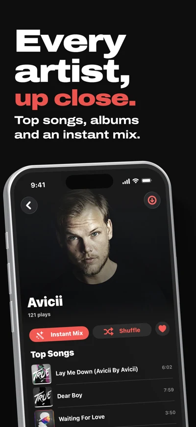
  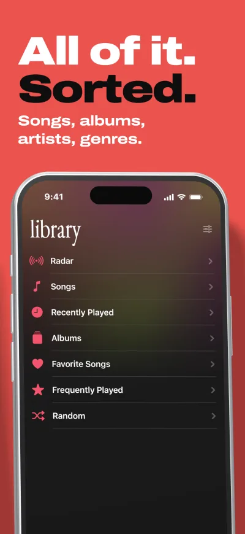
  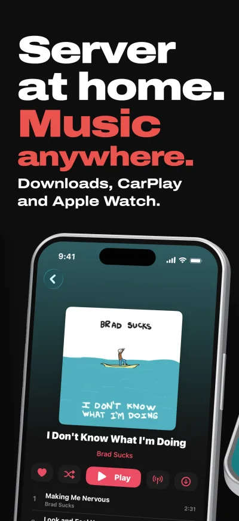
  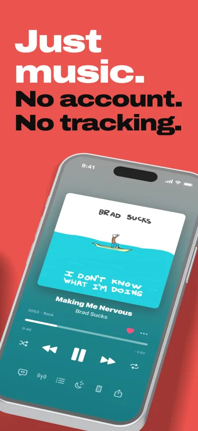
</p>
<p align="center">
  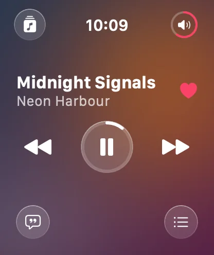
  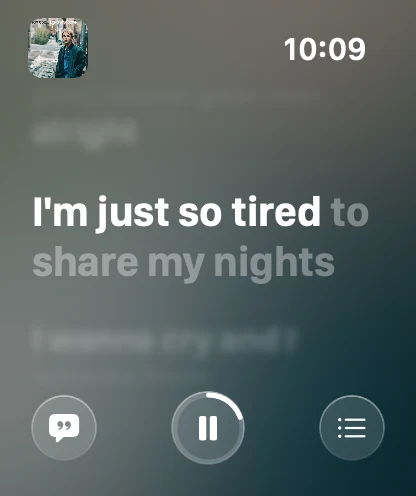
  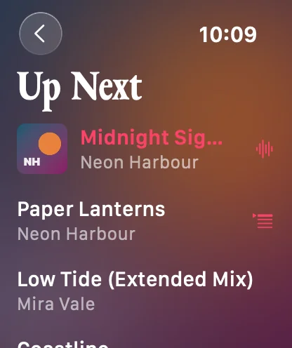
  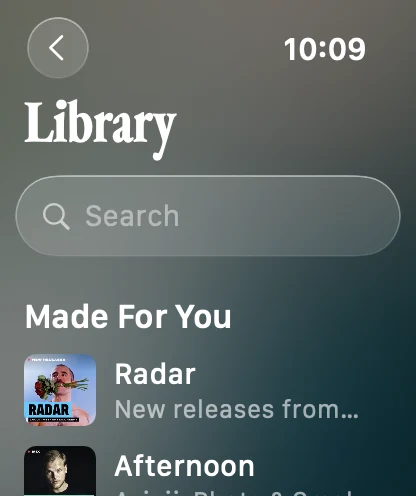
</p>

## Two builds

Both are free, and everything not listed here is the same in both.

| | App Store build | Sideload IPA |
|---|---|---|
| CarPlay | Yes | No: re-signing the IPA drops Apple's CarPlay entitlement |
| Get It (Soulseek via your own [slskd](https://github.com/slskd/slskd)) | No | Opt-in, under Settings → Beta Features |
| NetEase lyrics-timing check for remixes and edits | No | Yes |

**Get It** fetches what your library is missing: a Radar release, a Deezer result in Search, the missing songs of an
album you have only part of (one by one, or with Get All), or the heart on a preview in Now Playing. Aura finds the
release on Soulseek through your slskd, downloads it, and waits for your server to add it, with a card above the mini
player and a Live Activity following each step. Nothing goes through anyone else's server. Only download music you
have the right to.

The **NetEase check** asks NetEase's catalogue, by title, artist and length, for lyrics timed to the exact recording,
since lyrics sources often file a remix under the original's timing.

The sideload build can also follow a SoulSync watchlist from the Radar, and write lyrics you time by hand to your
server as `.lrc` files through File Browser.

## Install

### Sideload the IPA

1. Install a sideloading tool on your iPhone: [AltStore](https://altstore.io), [SideStore](https://sidestore.io) or Feather.
2. Download `Aura-v<version>.ipa` from the [latest release](https://github.com/adrbn/aura/releases/latest). Each release lists its SHA-256 checksum.
3. Open the IPA in your sideloading tool and install it.
4. On first launch iOS blocks the app: go to **Settings → General → VPN & Device Management** and trust the developer profile.
5. Open Aura and enter your server's address, username and password.

Installing a new IPA over an earlier sideload keeps your servers, passwords, downloads and pins. With a free Apple ID,
the signature expires after 7 days and the sideloading tool has to refresh it; that's an iOS limit, not Aura's.

### App Store

Aura is in App Review as **Aura: Self-Hosted Music**. It will be free, with no in-app purchases.

## Requirements

- iPhone with iOS 26 or later.
- Apple Watch with watchOS 26 or later, for the watch app.
- A [Navidrome](https://www.navidrome.org) server, or any server speaking Subsonic API 1.16.1. OpenSubsonic extensions are used when the server offers them.

No server yet? Try Aura against Navidrome's public demo: `https://demo.navidrome.org`, user `demo`, password `demo`.

## Build from source

```bash
git clone https://github.com/adrbn/aura
cd aura
open Aura/Aura.xcodeproj
```

- Xcode 26 or later (App Store archives are made with Xcode 26.6).
- Select your own team under Signing & Capabilities, and set the `AURA_BUNDLE_BASE` build setting at the project level to a bundle identifier you own. The widget, watch app and Mac targets derive theirs from it.
- Schemes and configurations:
  - **Aura**, with `Debug` and `Release`: the sideload build, with Get It and the NetEase check.
  - **Aura-AppStore**, with `Release-AppStore`: built with the `APPSTORE_BUILD` flag, which compiles the sideload-only features out.
  - **Aura-mac**: a macOS preview build; only the iPhone is tested daily.
- CarPlay needs Apple's `carplay-audio` entitlement on your own team.
- `scripts/watch-screenshots.sh` draws the watch app's pages on a Mac without a watch or simulator.

The fonts (Vavin and Archivo, both SIL OFL 1.1) are in the repository, so a fresh clone builds with nothing to add.

The art on this page is made by [`docs/assets/make_svgs.py`](docs/assets/make_svgs.py) (Python, standard library
only): `python3 docs/assets/make_svgs.py` regenerates every SVG. The hero and the Made For You card embed real captures
of the app, kept small in `docs/assets/readme-src/`.

## Privacy

Aura has no account and no analytics, and sends nothing to the developer. Server passwords are kept in the iOS
Keychain. It talks to your server and to the public services listed in the
[privacy policy](https://adrbn.github.io/aura-site/privacy.html), which says exactly what each one receives: lyrics,
credits, covers, artist photos, the Radar and share links.

## Contributing

Bugs and feature requests: [github.com/adrbn/aura/issues](https://github.com/adrbn/aura/issues). Pull requests are
welcome. The [changelog](CHANGELOG.md) describes what changed and why.

## Support

Aura is free, and stays free. If it earns a place on your home screen:

<a href="https://ko-fi.com/adrbn"></a>

A star on the repo helps other people find it too.

## License

[GPL-3.0](LICENSE) © 2026 adrbn. You may share and change Aura under the same license; a modified version you
distribute must stay open under GPL-3.0.

## Credits

- [LRCLIB](https://lrclib.net) for lyrics, [MusicBrainz](https://musicbrainz.org) for song credits, [Deezer](https://www.deezer.com)'s public catalogue for covers, artist photos, the Radar and previews, and the iTunes Search API for share links.
- Optional, with your own key: [Google Gemini](https://ai.google.dev) for lyrics translation and [Last.fm](https://www.last.fm) for listening statistics.
- Fonts: [Archivo](https://github.com/Omnibus-Type/Archivo) and Vavin, both under the SIL Open Font License 1.1.
- The release titles in the Radar and Downloads pictures are freely licensed albums from the Navidrome demo library: Nine Inch Nails, *The Slip* (CC BY-NC-SA 3.0 US); Brad Sucks, *I Don't Know What I'm Doing* (CC BY-NC-SA 2.5); The Polish Ambassador, *Pushing Through The Pavement* (CC BY-NC-SA 3.0); Natasha Beller, *Fairytale* (CC BY-NC-SA 4.0). The hero and the Made For You covers are real captures of the app on the developer's own library; the song and artist names drawn in the other cards are made up.

<sub>Aura is not affiliated with Navidrome, Subsonic or Apple. All trademarks belong to their respective owners.</sub>
