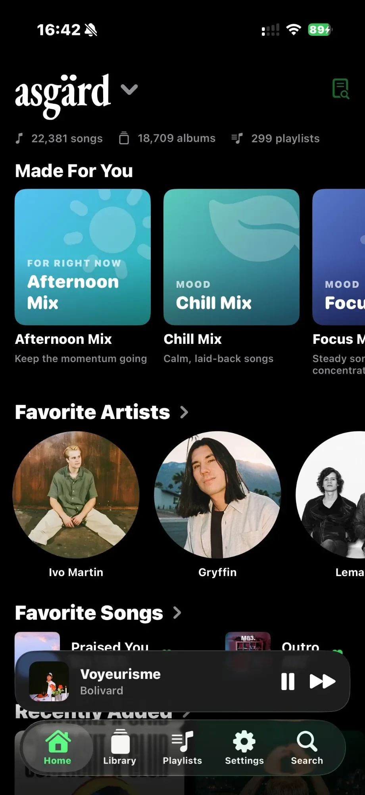
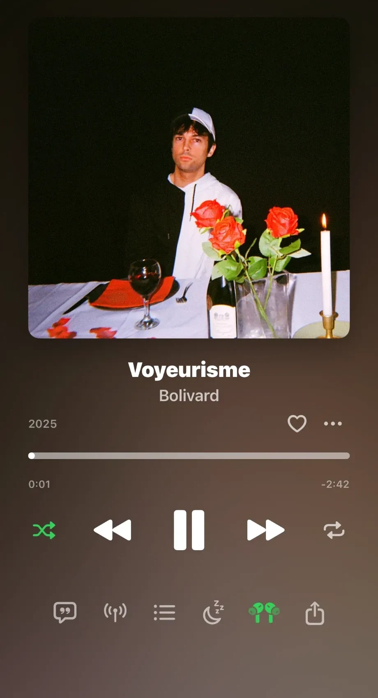
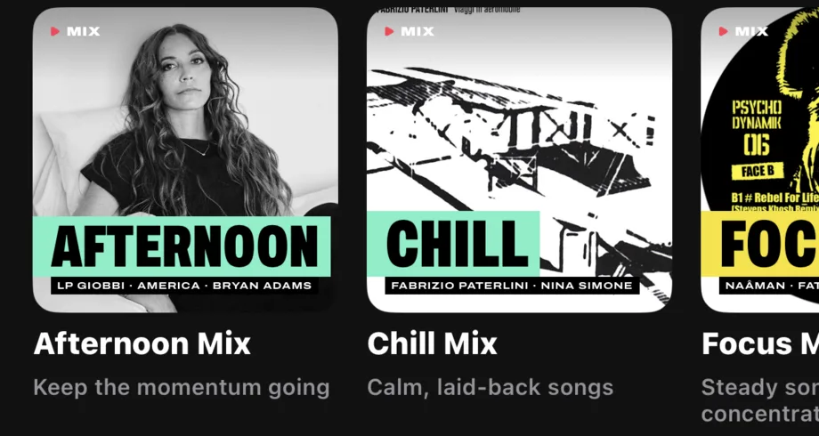
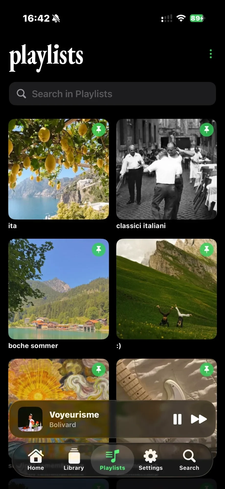
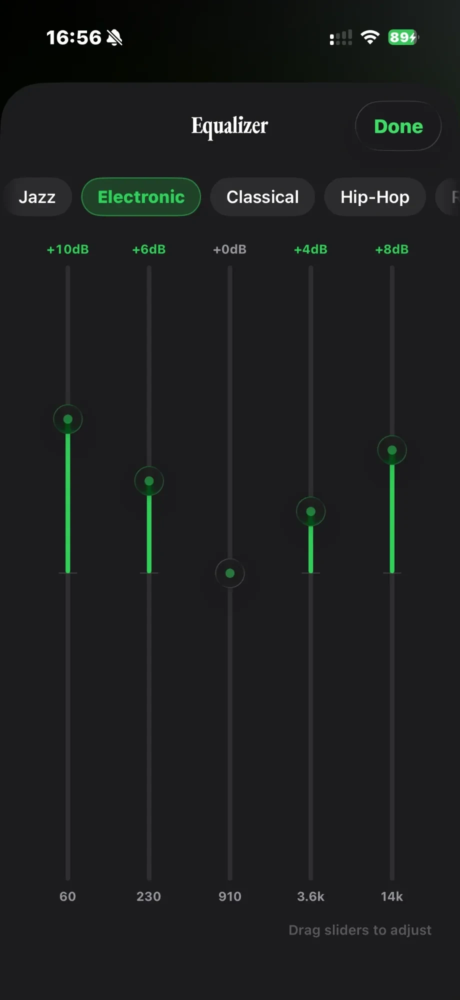

<div align="center">


# Aura

### Your own music library, in an app you'd choose on merit.

Aura is a native iOS player for the Navidrome or Subsonic server you already run.<br/>
Lossless streaming, lyrics that light up word by word, a real equalizer — and all of it offline.

<br/>

<a href="https://github.com/adrbn/aura/releases"></a>

<sub>iOS 26 or later · Free and open source · Bring your own server</sub>

[](https://github.com/adrbn/aura/releases)
[](https://developer.apple.com/xcode/swiftui/)
[](LICENSE)

<br/>



</div>

## The problem

You host your own music. You ripped it, tagged it, paid for it — and then you play it through an app that feels like a remote control for a database: a folder tree, a play button, artwork that shows up when it feels like it, and a queue that forgets what it was doing.

Meanwhile the app you're implicitly compared to is Apple Music, and it sets the bar: artwork everywhere, lyrics in time with the voice, something to listen to before you've decided what to listen to.

Aura is built to that bar, on top of your server. It talks plain Subsonic API, it stores nothing about you anywhere, and it never asks you to move your library.

> **Aura is a client, not a server.** Point it at a Navidrome / Subsonic-compatible server you own. It plays your library — it doesn't host, provide, or find music for you.

## Playing



Stream your files as they are — FLAC and ALAC stay lossless — or let Aura transcode on the way out when you're on cellular. Formats iOS can't open (OGG, Opus, WMA) are transcoded by the server automatically, so nothing in your library is unplayable.

**A 5-band equalizer** you shape by dragging a curve, with 15 presets, **ReplayGain**, and a **sleep timer** that fades out rather than cutting.

The queue is a real queue: play next, add to the end, drag to reorder, and an autoplay tail that keeps the music going when it runs out.

Everything lands where iOS expects it — Lock Screen, Control Center, the Dynamic Island, a Live Activity, AirPlay, the Share Sheet — and in the car, CarPlay's Now Playing screen, shuffle and repeat included. **Siri** covers play, pause, next, previous, shuffle, repeat and favourite, plus *"play &lt;playlist&gt;"*, *"play &lt;album&gt;"* and *"play my favourites"* — in English and in French (*« Joue mes favoris sur Aura »*), with the app closed.

<br clear="right"/>

## Lyrics, word by word

Aura reads per-word timings from the OpenSubsonic lyrics extension, falls back to line timings, then to plain text, and fills the gaps from [LRCLIB](https://lrclib.net).

Each word lights as it is sung. The lines around it fall away in size, blur and opacity, so the line being sung is the only one competing for your attention. Tap any line to jump there, nudge the timing if your headphones lag, and turn the phone for full screen.

## Made for you



**Instant Mix** builds a radio from any song or artist. Above it, Aura generates mixes from what's actually in your library — by genre, by mood, by time of day — and a **Year Wrapped** retrospective from what you really played, counted on the device.

**Radar** gathers what the artists you play most released in the last 30 days, newest first. What your server already has plays whole; what it doesn't plays as thirty-second previews, so you can hear a release before you decide you want it. Each release opens its own page, songs the server holds marked. Add one to your server and it joins the mix within a quarter of an hour — a release you have only part of stays listed, with how many songs are left to get.

Each mix gets an **editorial cover**, the way a streaming service would design one: the photo of the artist you play most in it, framed on the face with Apple Vision, under a type-set title — a duotone for genre mixes, a figure cut out over the year for Wrapped, and for a radio the seed artist in a disc sending out rings, with two of the artists it found riding the first one. Save a radio or a mix as a playlist and the cover goes with it, onto your server.

## Your library, the way you left it



Unified search across songs, albums, artists and playlists, ranked so the thing you typed comes first — with a Recently Searched list that remembers what you *played*, not everything you tapped. With the Radar on, it also shows what your server doesn't have yet, with previews.

Album, playlist, mix and radio pages open in the colour of their artwork, fading into the page as you scroll; artist pages frame the photo on the face instead of cropping at the forehead.

Playlists as a grid of covers or a list, narrowed in a tap to the pinned ones, the saved radios, the mixes, yours, the shared ones or the downloaded ones. Custom playlist covers, an A–Z rail for scrolling long lists, content-based duplicate detection, multi-folder Navidrome libraries, and **several servers** you can switch between from the Home title.

<br clear="right"/>

## Offline, properly

Download a song, an album, a playlist, or the entire library, and everything keeps working with the server switched off — including search. What you stream is cached as you go, with a size limit you set.

When the server is simply unreachable, Aura says so and falls back to what it holds, instead of showing you a screen of empty squares.

## The equalizer



Five bands from 60 Hz to 14 kHz, drawn as one curve over a decibel grid: drag anywhere on it and the nearest band follows. Fifteen presets sit beneath, and the curve glides to each one. It runs in the audio graph, not as a gimmick — the gain is applied to the stream itself and survives backgrounding, AirPlay and CarPlay.

<br clear="right"/>

## Private by design

- **Your credentials live in the Keychain**, never in preferences or a file, and never leave the device except to your own server.
- **No account, no analytics, no telemetry.** Aura talks to your server; to LRCLIB when a song has no lyrics of its own or names a version whose lyrics need checking; to Deezer's public catalogue for the artist photos on mix covers, the Radar's new releases and their previews — artist names and release ids, never your library; and to Apple's and Deezer's public search when you share a song, to find it on other services. Switch the Radar off and Deezer hears only about cover photos and the songs you share. The details are in the [privacy policy](PRIVACY.md).
- **Play counts and history stay on the device** unless you point Aura at your own scrobbler.
- **Open source**, so none of this has to be taken on trust.

## Install

1. **Download the IPA** from [Releases](https://github.com/adrbn/aura/releases) and install it with AltStore or SideStore. *(An App Store release is on its way.)*
2. Open Aura and enter your server's address, username and password.
3. That's it — no account to create, nothing to configure.

### Build from source

```bash
git clone https://github.com/adrbn/aura
cd aura
open Aura/Aura.xcodeproj   # Xcode 26+, iOS 26 target — run the "Aura" scheme
```

Two configurations ship: the App Store build, and a sideload build that additionally bundles an optional Soulseek/slskd integration, compiled out of the App Store version.

### What the sideload build adds

If you run [slskd](https://github.com/slskd/slskd) next to your server, the sideload build can fetch what you're missing. **Get It** on a Radar release, on a song found in Search, or the heart on a preview in Now Playing: Aura picks the copy with the most of the release's tracks, in the best quality, from a peer with a free slot, moves on if a download stalls, and waits for your server to add it. A card above the mini player and a Live Activity follow each step — looking, downloading, adding, ready — and a liked song is starred once it lands. You point it at your own slskd; nothing goes through anyone else's.

## Compatibility

**Navidrome** (primary, tested daily against a 22,000-track library) and any server speaking **Subsonic API v1.16.1** — Airsonic, Gonic, and friends. OpenSubsonic extensions are used when the server offers them, and skipped when it doesn't.

## FAQ

<details>
<summary><b>Do I need a server?</b></summary>
<br/>

Yes. Aura plays a library you already host — most people run [Navidrome](https://www.navidrome.org), which is a single binary pointed at a folder of music. Aura hosts nothing and cannot find music for you.
</details>

<details>
<summary><b>Some albums show a generated cover instead of artwork.</b></summary>
<br/>

That's Aura telling you the truth: the server has no artwork for that album. Rather than display the server's own "no cover" picture — a vinyl record with someone else's branding on it — Aura draws its own. Embed the artwork in the files and rescan, and the real cover appears.
</details>

<details>
<summary><b>Is playback gapless?</b></summary>
<br/>

Not yet. Aura had a gapless switch that was wired to nothing; it was removed rather than left there looking honest. Real gapless playback needs a different player pipeline and is on the [roadmap](docs/ROADMAP.md).
</details>

<details>
<summary><b>Where do the lyrics come from?</b></summary>
<br/>

Your server first, through the OpenSubsonic lyrics extension — so lyrics you embedded in your own files win. When a song has none, Aura asks LRCLIB, a community database, using the title and artist only.

A duet, a remix or a translated version keeps the original's title, and lyrics sources often hand back the original's words. When a song names its version — a featured artist, a tag in brackets — Aura asks LRCLIB for that version's sheets, once, and switches to them when most of them disagree with what was found.
</details>

<details>
<summary><b>Does it run on iPad or Mac?</b></summary>
<br/>

It builds and runs, and a macOS target exists, but the iPhone is what gets tested daily. Treat the others as previews.
</details>

<details>
<summary><b>What about the typeface?</b></summary>
<br/>

Aura is set in **Vavin Condensed**, a Garamond-inspired face drawn for this app and released under the SIL Open Font License 1.1. It lives in this repository and ships in the build — nothing to buy, nothing to drop in. `Vavin-OFL.txt` travels in the bundle as the licence requires. The mix covers are set in [Archivo](https://github.com/Omnibus-Type/Archivo), also OFL, with `Archivo-OFL.txt` alongside.
</details>

## More

- [Roadmap](docs/ROADMAP.md) — what's next, and what people asked for in other clients that Aura already does.
- [Changelog](CHANGELOG.md)
- [Privacy policy](PRIVACY.md)
- [Report a bug or ask for a feature](https://github.com/adrbn/aura/issues)

## Support

Aura is free, and stays free. If it earns a place on your home screen:

<a href="https://ko-fi.com/adrbn"></a> &nbsp;
<a href="https://github.com/sponsors/adrbn"></a> &nbsp; — or star the repo, which genuinely helps.

## License

[MIT](LICENSE) © 2026 Adrien Robino

<sub>Aura is not affiliated with Navidrome, Subsonic, Apple, or any server project mentioned. All trademarks belong to their respective owners.</sub>
